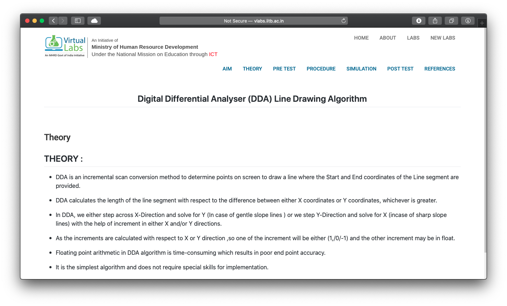
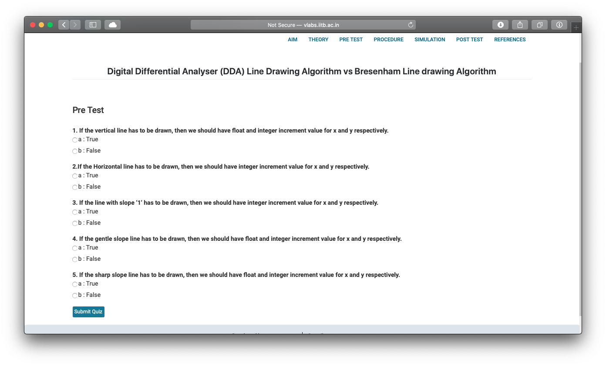
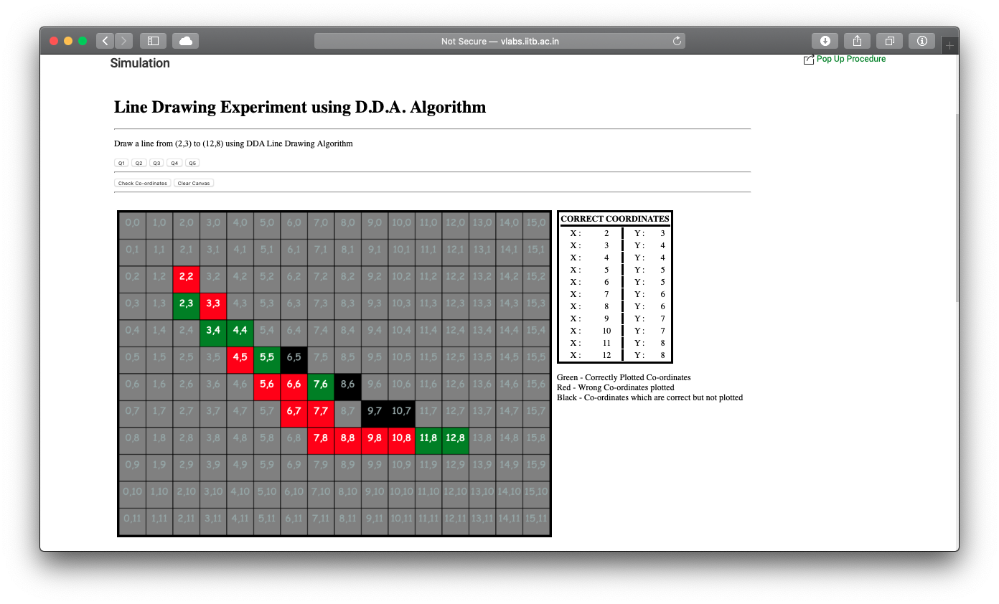
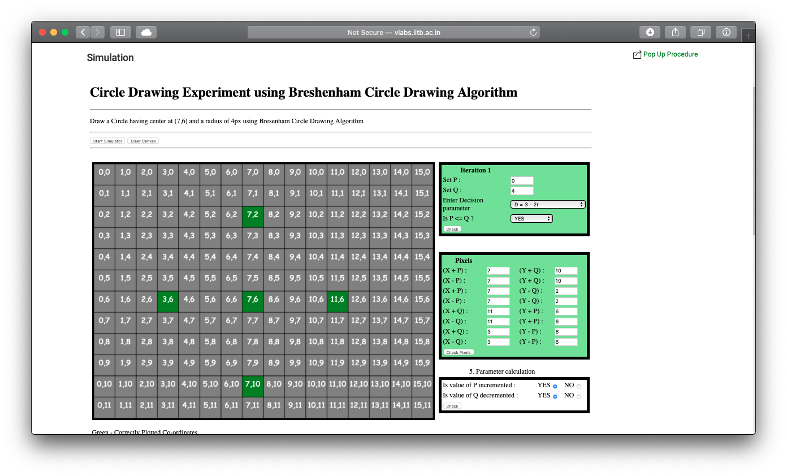
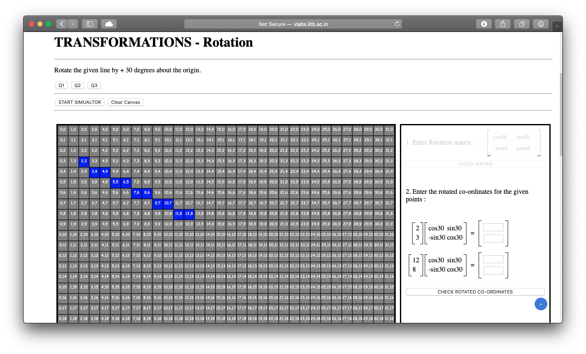
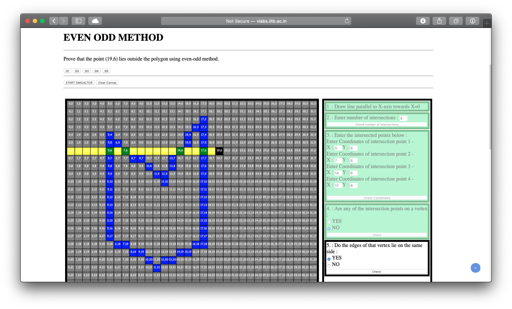

# cg-vlab
A virtual lab for learning concepts related to Computer Graphics.

# Background

Virtual Labs is a project initiated by the Ministry of Human Resource Development (MHRD), Government of India, under the National Mission on Education through Information and Communication Technology (NMEICT).

Good lab facilities and updated lab experiments are critical for any engineering college. Physical distances and the lack of resources often make it difficult to perform experiments, especially when they involve sophisticated instruments. Also, good teachers are always a scarce resource. The ‘Virtual Labs’ project addresses this issue of lack of good lab facilities, as well as trained teachers, by making remote experimentation possible. Another objective is to arouse the curiosity of the students and permit them to learn at their own pace. This facilitates the absorption of basic and advanced concepts through simulation and remote experimentation. Internet based experimentation further permits use of resources – knowledge, software, and data available on the web, apart from encouraging skillful experiments being simultaneously performed at points separated in space.

# About this Lab
The computer graphics virtual lab is approved by IIT-Bombay and is available to all on their official portal [Vlabs-Dev](http://vlabs.iitb.ac.in/vlabs-dev/labs/cglab/index.php).

The vitual lab is also available on [Github Pages](https://ptp28.github.io/cg-vlab/).

# List of Experiments

1. Digital Differential Analyser (DDA) Line Drawing Algorithm
2. Bresenham Line Drawing Algorithm
3. Comparison of DDA and Bresenham Line Drawing Algorithms
4. Bresenham Circle Drawing Algorithm
5. Transformation : Translation of 2-D Object
6. Transformation : Scaling of 2-D Object
7. Transformation : Rotation of 2-D Object
8. Even-Odd Method (to check if point is inside Polygon or not)

### Each experiment has the following - 

* Aim
    - Aim of the experiment.
* Theory
    - Theory explaining the experiment.
* Pre-Test
    - A list of questions that the user must answer correctly before proceding with the experiment.
* Procedure
    - The working explaination / algorithm of the experiment.
* Simulation
    - An interactive canvas where the user will be asked to perform the experiment.
    - All simulations are engaging and are designed to test the user's knowledge of that particular experiment.
* Post-Test
    - A list of questions the user must answer correctly after performing the experiment.
    
    
# Screenshots

- #### Theory

- #### Pre-Test

- #### DDA Algorithm Simulation

- #### Bresenham Circle Drawing Algorithm Simulation

- #### Transformation - Rotation Simulation

- #### Even-Odd Method Simulation

 
